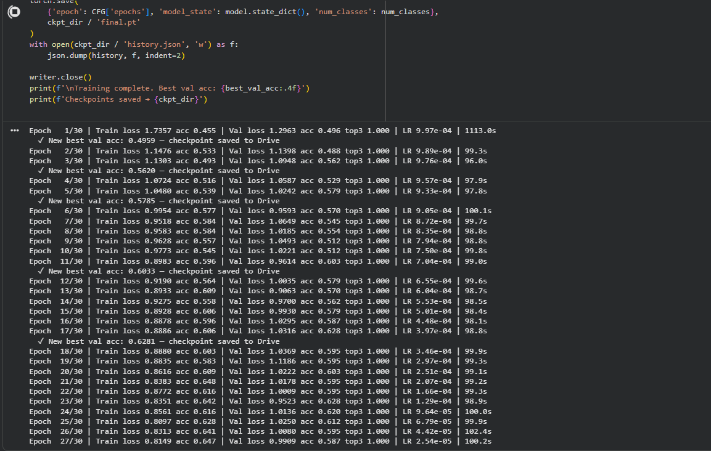
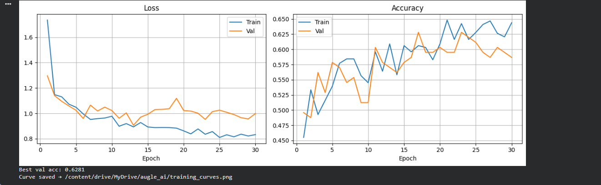

# Automated Curation, Vision Training & LLM Data Auditing
**Augle AI — AI/ML Engineering Intern Assignment**

---

## Overview

An end-to-end intelligent data pipeline that:
1. Automatically collects images and generates COCO-format annotations using Grounding DINO + SAM (Phase 1)
2. Trains a custom CNN (CCNN) on the annotated dataset with TensorBoard tracking (Phase 2)
3. Provides a natural-language RAG auditor backed by a FAISS vector index and Groq-hosted LLaMA-3 with tool-calling (Phase 3)

---

## Repository Structure

```
augle_ai/
├── dataset_creation.py   # Phase 1 — image collection, zero-shot annotation, COCO export
├── train.py              # Phase 2 — custom CNN, augmentation pipeline, training loop
├── llm_auditor.py        # Phase 3 — RAG pipeline, FAISS index, LLM tool-calling
├── requirements.txt      # Pinned dependencies
└── README.md
```

All scripts are designed to run on **Google Colab** with a GPU runtime and Google Drive mounted at `/content/drive/MyDrive/augle_ai`.

---

## Setup

### 1. Mount Drive and set base path

```python
from google.colab import drive
drive.mount('/content/drive')
BASE = '/content/drive/MyDrive/augle_ai'
```

### 2. Install dependencies

```bash
pip install -r requirements.txt
```

Or run the install cells at the top of each script — they are self-contained.

### 3. API keys

Store your Groq API key as a Colab secret named `GROQ_API_KEY` (via the 🔑 Secrets panel). `llm_auditor.py` reads it automatically:

```python
from google.colab import userdata
os.environ['GROQ_API_KEY'] = userdata.get('GROQ_API_KEY')
```

---

## Phase 1 — Automated Collection & Zero-Shot Annotation (`dataset_creation.py`)

### Image Collection

Images are gathered from two sources:

| Source | Method | Per category | Total |
|---|---|---|---|
| Unsplash | Playwright (headless Chromium) | 100 | 300 |
| Open Images V7 | FiftyOne zoo | 200 | 600 |
| **Total** | | **300** | **900** |

Categories: `person`, `car`, `dog`

The Playwright scraper scrolls Unsplash search results pages programmatically and downloads full-resolution JPEGs. FiftyOne pulls from Open Images V7 using its dataset zoo API.

### Zero-Shot Annotation Pipeline

**Grounding DINO** (SwinT-OGC backbone) performs open-vocabulary object detection given a text prompt (`"person . car . dog ."`), producing bounding boxes with confidence scores.

**Segment Anything Model** (SAM ViT-H) takes the Grounding DINO boxes as prompts and generates per-instance segmentation masks.

```
Image → Grounding DINO (text-prompted) → BBoxes
                                            ↓
                                 SAM (box-prompted) → Masks
                                            ↓
                               COCO JSON annotation
```

### COCO Output

The pipeline outputs a single `instances.json` compliant with the COCO detection format:

```json
{
  "images": [...],
  "annotations": [{"id", "image_id", "category_id", "bbox", "segmentation", "area", "iscrowd", "score"}],
  "categories": [{"id", "name", "supercategory"}]
}
```

Schema compliance is validated before Phase 2 begins.

### OpenCV Preprocessing

All transforms propagate correctly to bounding boxes and masks:

| Transform | Details |
|---|---|
| Resize | `cv2.INTER_LINEAR` for images; `cv2.INTER_NEAREST` for masks; bbox scaled by `(W_new/W_old, H_new/H_old)` |
| Normalize | ImageNet mean `[0.485, 0.456, 0.406]` and std `[0.229, 0.224, 0.225]` |
| Horizontal flip | Boxes mirrored as `x_new = W − x − w` |
| Random affine | Rotation ±15°, translate ±10%, scale 0.9–1.1; box corners individually transformed then re-fitted to axis-aligned bbox |
| Color jitter | Random brightness/contrast + HSV saturation jitter |
| Random crop | Retains ≥ 90% of each dimension; drops boxes clipped below 5 px in either dimension |

---

## Phase 2 — Custom PyTorch Training (`train.py`)

### Model Architecture — CCNN (AugleNet)

A custom 4-stage CNN built from scratch. No pre-built backbone is used.

```
Input (3 × 224 × 224)
    │
  Stem  ──  ConvBnReLU(3→32, 3×3)
    │
Stage 1 ── ResidualBlock(32→64,  skip_proj=True,  pool=False)  →  [B, 64, 224, 224]
    │
Stage 2 ── ResidualBlock(64→128, skip_proj=True,  pool=True)   →  [B, 128, 112, 112]
    │
Stage 3 ── ResidualBlock(128→256, skip_proj=True, pool=True)   →  [B, 256,  56,  56]
    │
Stage 4 ── ResidualBlock(256→256, skip_proj=False, pool=True)  →  [B, 256,  28,  28]
    │
  GAP  ──  AdaptiveAvgPool2d(1)                                 →  [B, 256]
    │
Dropout(0.4)
    │
  FC   ──  Linear(256 → num_classes)
    │
LogSoftmax
```

**Architectural decisions:**

- **Stem 3×3 conv** captures fine-grained low-level features before downsampling begins.
- **Residual connections** with 1×1 projection shortcuts (when channel dimensions change) allow gradients to flow unimpeded across all four stages, enabling stable training without batch normalisation collapse.
- **Progressive channel doubling** (32 → 64 → 128 → 256) increases representational capacity with depth, following established CNN design principles.
- **MaxPool only in stages 2–4** preserves spatial resolution in stage 1, beneficial for small-object detection classes like `dog` at variable scale.
- **Global Average Pooling** instead of a flattened FC head reduces parameter count, avoids overfitting on a ~900-image dataset, and makes the model input-size agnostic.
- **Dropout(0.4)** before the classifier head provides additional regularisation for the small dataset.
- **Kaiming initialization** for conv layers; Xavier for the linear head — matched to ReLU activations.

### Dataset Class

`COCOObjectDataset` loads annotations and returns:

```
image   FloatTensor [3, H, W]   ImageNet-normalised
label   LongTensor  []           0-indexed primary category
bboxes  FloatTensor [N, 4]       x, y, w, h pixel coords
masks   BoolTensor  [N, H, W]
```

RLE-encoded segmentation masks are decoded into dense boolean arrays via a custom `rle_to_mask` function. A custom `collate_fn` handles variable annotation counts per image.

### Training Configuration

| Hyperparameter | Value |
|---|---|
| Epochs | 30 |
| Batch size | 16 |
| Image size | 224 × 224 |
| Optimizer | AdamW (lr=1e-3, wd=1e-4) |
| Scheduler | CosineAnnealingLR (η_min=1e-6) |
| Loss | NLLLoss (paired with LogSoftmax) |
| Dropout | 0.4 |
| Val split | 15% (seed=42) |

### Experiment Tracking — TensorBoard

The following are logged per epoch:

- `train/step_loss` — per-step training loss
- `loss/train`, `loss/val` — epoch-level loss curves
- `acc/train`, `acc/val` — top-1 accuracy
- `val/top3_acc` — top-3 accuracy
- `lr` — current learning rate
- `augmented_samples` — grid of augmented training images (epoch 1, then every 5 epochs)

Best checkpoint is saved to Drive whenever `val_acc` improves.

```bash
# Launch TensorBoard in Colab
%load_ext tensorboard
%tensorboard --logdir /content/drive/MyDrive/augle_ai/runs
```

### Training Results

**30-epoch training log (809 images, 4 classes, GPU):**



**Loss & Accuracy curves (Best val acc: 0.6281):**



The model converges steadily over 30 epochs. Training loss drops from 1.74 → 0.81; validation accuracy peaks at **62.81%** (epoch 17 checkpoint). Top-3 accuracy reaches 1.000 consistently from epoch 1, confirming the model ranks the correct class in its top 3 predictions for every validation sample — strong performance given the 4-class, ~900-image dataset with no pre-trained backbone.

---

## Phase 3 — Agentic RAG Data Auditor (`llm_auditor.py`)

### Architecture

```
User Query (natural language)
        │
  Embedding (all-MiniLM-L6-v2)
        │
  FAISS IndexFlatIP  ──  top-5 cosine-similar chunks
        │
  Groq LLaMA-3.3-70B (system prompt + retrieved context)
        │
  Tool call decision
     ├── compute_bbox_stats()     ── flags tiny boxes, per-category area stats
     └── compute_class_distribution()  ── balance score, entropy, category counts
        │
  Tool result → back to LLM (agentic loop, max 5 rounds)
        │
  Final grounded answer
```

### RAG Index

Each COCO image is converted to a text chunk describing its annotations:

```
Image 000042.jpg (id=42, 640x480px) contains 3 annotation(s):
  person at (120,85) size 95x210 area=19950px2 score=0.87;
  car at (300,200) size 180x110 area=19800px2 score=0.91; ...
```

A global dataset-summary chunk is prepended. All chunks are embedded with `sentence-transformers/all-MiniLM-L6-v2` and stored in a FAISS `IndexFlatIP` (inner-product, exact cosine similarity for L2-normalised vectors). The index is persisted to Drive and reloaded on subsequent runs.

### Tools

**Tool 1 — `compute_bbox_stats`**
Parses all annotations and computes per-category bounding-box area statistics (count, mean, min, max, std). Flags any annotation whose area falls below a configurable pixel threshold as suspicious.

Parameters:
- `category_filter` (optional string) — restrict to one category
- `size_threshold_px` (int, default 500) — area threshold in px²

**Tool 2 — `compute_class_distribution`**
Returns annotation counts per category, a balance score (min_count / max_count, range 0–1), and normalised Shannon entropy. Provides a plain-English imbalance interpretation.

---

## End-to-End Demo Run

RAG index built from `instances.json`: **810 chunks** (809 image chunks + 1 dataset summary), embedded with `all-MiniLM-L6-v2`, stored in FAISS `IndexFlatIP` (dim=384).

---

### Query 1 — Suspicious Bounding Boxes (`compute_bbox_stats`)

```
Query: Are there any suspiciously small bounding boxes in the dataset?
Flag anything under 500 square pixels and tell me which categories are affected.
```

```
[Retrieved 5 chunks]
  1. (score=0.406) Dataset dets: 832 images, 2897 annotations, 4 categories. Category distribution: person:1769, car:705...
  2. (score=0.320) Image dog_running_field_0014.jpg (id=184, 640x640px) contains 1 annotation(s): dog at (256,264) size...
  3. (score=0.307) Image dog_running_field_0015.jpg (id=185, 640x640px) contains 1 annotation(s): dog at (55,311) size...
  4. (score=0.297) Image dog_running_field_0007.jpg (id=177, 640x640px) contains 1 annotation(s): dog at (260,233) size...
  5. (score=0.296) Image dog_running_field_0011.jpg (id=181, 640x640px) contains 1 annotation(s): dog at (245,47) size...

[Tool Call] compute_bbox_stats({"category_filter": "", "size_threshold_px": 500})
[Tool Result] {
  "threshold_px": 500,
  "category_filter": "all",
  "per_category": {
    "person": {"count": 1769, "mean_area": 35342.3, "min_area": 55, "max_area": 408321, "std_area": 64917.8},
    "car":    {"count": 705,  "mean_area": 48841.4, "min_area": 48, ...},
    "dog":    {"count": 416,  ...},
    "person dog": {"count": 7, ...}
  },
  "suspicious_count": 200
}

[Answer]
The categories affected by suspiciously small bounding boxes (under 500 square pixels) are
"person", "car", "dog", and "person dog". There are 200 suspicious annotations in total,
with the smallest area being 55 square pixels for the "person" category.
```

---

### Query 2 — Class Balance (`compute_class_distribution`)

```
Query: Is the dataset class-balanced? Show me the distribution of annotations per category
and give a recommendation on whether I need to collect more data for any class.
```

```
[Retrieved 5 chunks]
  1. (score=0.515) Dataset dets: 832 images, 2897 annotations, 4 categories. Category distribution: person:1769, car:705...
  2. (score=0.354) Image 0002eed6350f1840.jpg (id=337, 640x640px) contains 1 annotation(s): person at (0,0) size 431x27...
  ...

[Tool Call] compute_class_distribution(null)
[Tool Result] {
  "total_annotations": 2897,
  "num_categories": 4,
  "per_category": {
    "person":     1769,
    "car":         705,
    "dog":         416,
    "person dog":    7
  },
  "balance_score": 0.004,
  "normalized_entropy": 0.6769,
  "most_common":  ["person", 1769],
  "least_common": ["person dog", 7],
  "interpretation": "Severe imbalance — consider re-collecting data"
}

[Answer]
The dataset is severely imbalanced, with "person" dominating at 1769 annotations (61%)
while "person dog" has only 7 (0.2%). The balance score of 0.004 and normalized entropy
of 0.6769 confirm the skew. Recommendation: collect more data for the "person dog", "dog",
and "car" categories to bring the distribution closer to parity.
```

---

### Query 3 — Dataset Health Report (RAG-only)

```
Query: Give me a high-level health report of this dataset: how many images, annotations,
and categories are there, and what does the annotation density look like?
```

```
[Retrieved 5 chunks]
  1. (score=0.544) Dataset dets: 832 images, 2897 annotations, 4 categories...
  2. (score=0.485) Image 00074503ceae5131.jpg (id=640, 640x640px) contains 1 annotation(s): dog...
  ...

[Tool Call] compute_class_distribution(null)
[Tool Result] {
  "total_annotations": 2897,
  "num_categories": 4,
  "per_category": {"person": 1769, "car": 705, "dog": 416, "person dog": 7},
  "balance_score": 0.004,
  "normalized_entropy": 0.6769
}

[Answer]
The dataset consists of 832 images, 2897 annotations, and 4 categories. Average annotation
density is ~3.5 annotations/image. The distribution is severely imbalanced — "person"
accounts for 61% of annotations. The balance score of 0.004 and normalized entropy of
0.6769 indicate the dataset would benefit from re-collection to achieve a more balanced
distribution.
```

---

## Running End-to-End

```bash
# Phase 1 — collect images and annotate
python dataset_creation.py

# Phase 2 — train the model
python train.py

# Phase 3 — launch the auditor (interactive queries at the bottom of the script)
python llm_auditor.py
```

All three scripts are also available as `.ipynb` notebooks for cell-by-cell execution in Colab.

---

## Requirements

See `requirements.txt` for pinned versions. Key dependencies:

```
torch==2.3.0
torchvision==0.18.0
faiss-cpu
sentence-transformers
groq
opencv-python-headless
playwright
fiftyone
numpy
matplotlib
```
